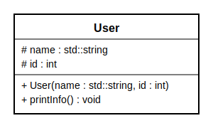

# Lab 3: Relations between Classes

This lab introduces fundamental concepts of object-oriented programming in C++, with a focus on modeling and implementing relationships between classes.

All the following sections of this lab are based on the following levels of dificulty:

🟢 __Simple__: A simple coding task that usually guides you step by step through the process and focuses on learning the basics. It should not take more than 15min to finish it. 

🟡 __Moderate__: A coding task that usually states a moderate problem to test your understanding and transfer skills from syntax to real-world applications. These tasks can be solved in about 30mins depending on your knowledge.

🔴 __Complex__: Quite a difficult or lengthy coding task that requires you to use the acquired knowledge of the previous tasks in a broader context or project. Such tasks might take up to a few hours to solve them.

## 🟡 Section I: UML Modeling – Online Learning Platform

In this section you will model a simplified **Online Learning Platform** and focus on identifying and designing **relationships** between classes.

You will practice the following concepts:

- UML class diagrams
- identifying **composition vs aggregation**  
- modeling multiplicities and associations  
- transferring UML into C++ code  

---

### 🧩 Task Description

You are asked to design a simplified **Online Learning Platform** (similar to Moodle).

The platform manages courses, learning content, and users.

---

### 📘 Requirements

- The platform offers multiple **courses**.
   - The number of courses is technically limited to **100**

- A **course** represents a learning unit:
  - it should have a title and a description  
  - it should allow adding or in general organizing its learning material 

- A course is structured into smaller parts called **lessons**:
  - each lesson can contain different types of **content**  
  - content could be, for example, text, video, or quizzes  

- Users can participate in courses:
  - a **user** should have identifying information  
  - users should be able to enroll or leave in courses  
  - users need to be registered **at least on one platform** (e.g. Moodle RV, FN, etc.) 

---

### Task Part 1 – UML Diagram

Create a UML class diagram in draw.io that:

1. Identifies all relevant classes based on the description  
2. Defines:
   - attributes with visibility and types  
   - methods (at least one meaningful method per class)

3. Models relationships:
   - clearly distinguish between:
     - **composition**
     - **aggregation**
     - **association**

4. Includes:
   - multiplicities (e.g. 1, 0..*, etc.)
   - roles or attributes connecting the classes

You must decide yourself:
- which elements should be modeled as **classes**
- which properties should be **attributes**
- which actions should be **methods**

and especially:

- which relationships are **compositions**
- which are **aggregations**
- which are simple **associations**

---

### Task Part 2 – Justification

Answer the following:

1. Which relationships did you model as **composition** and why?  
2. Which relationships did you model as **aggregation** and why?  
3. Which design decisions were not obvious and could be modeled differently?  

👉 There is not always a single correct answer — your reasoning is essential.

---

### Task Part 3 – C++ Implementation

Transfer your UML model into C++ code.

---

- Implement the classes you identified  
- Use appropriate access modifiers (`private`, `public`)  
- Represent relationships using:
  - direct members (for strong ownership)
  - pointers or references (for weaker relationships)

- In main, create objects of your classes
- Simulate interaction (e.g. enrolling, accessing content)  
- Call at least one method from each class  

## Section II: Inheritance in C++ – Basics and Practice

In this section you will explore inheritance as a fundamental mechanism to model relationships between classes and reuse code.

You will practice the following concepts:

basic inheritance syntax in C++
access modifiers (public, protected, private)
using protected members
constructors in base and derived classes
passing parameters to base class constructors

---

### 🧩 Task Description

You will extend a simple class hierarchy to model different types of users in a learning platform.

### 📘 Requirements

Start with a base class **User**.

Use the following UML class diagram:

The diagram specifies:
- attributes (including visibility)
- constructor
- member functions

---

### 🟢 Task Part 1 – UML Interpretation

- Interpret the UML diagram of the `User` class  
- Identify:
  - attributes and their visibility  
  - constructor parameters  
  - available methods
- Transfer it into C++ code

---

### 🟢 Task Part 2 – Basic Inheritance

- Create two derived classes:

  - `Student`
  - `Instructor`

- Both classes should:

  - inherit from `User`
  - have at least one additional attribute  
  - implement a method `printRole()` that uses the inherited attributes from `User` in the derived classes

- Add a short comment explaining:
  - why `protected` is used instead of `private`
- Implement constructors for `Student` and `Instructor`  
- Use initializer lists to call the base class constructor  

To test the classes in main:
- Create objects of:
  - `Student`
  - `Instructor`  

- Call:
  - `printInfo()`  
  - `printRole()`  

### 💬 Reflection Questions

1. What would change if the access specifier in the inheritance declaration is deleted?

2. Why is it important to call the base class constructor?  

## 🟡 Section III: Game Character System – Inheritance and Class Relationships

You are part of a small game development studio working on a new fantasy role-playing game.  
Your team is responsible for implementing the first version of the character system.

The game should support different types of characters, such as warriors and mages.  
Each character owns an inventory and can use a weapon. Your task is to model the system using UML and then implement it in C++.

---

### 🎯 Learning Goals

In this task you will practice:

- modeling inheritance in UML
- identifying class relationships
- distinguishing composition, aggregation, and association
- implementing inheritance in C++

---

### 📘 Requirements

The game contains different characters.

Each character has:

- a name
- health points
- a level

There are two main character types:

- `Warrior`
- `Mage`

A `Warrior` has:

- weapon skill points

A `Mage` has:

- mana points

Both types can regenerate their specific points and have a method to display their status including:
- name
- their type
- health points
- magic points or weapon skill points
- level
- current weapon
- number of items in inventory compared to maximum slot number (e.g. 4/10)

In addition, there are jobs with specific skills which are based on exactly one of these two character types such as:
- Thief (can steal from enemies)
- Healer (can heal other characters and himself)

The minimum level is 1 while the maximum level is 10.
To reach the next level, a level specific experience point limit has to be surpassed.
In that case, the method levelUp() should be called.

Every job skill should return the calling object so that multiple skills can be called fluently in sequence.

Each character owns exactly one `Inventory`.

An `Inventory` can store a limited number of item names.

A character can use one `Weapon`.

A `Weapon` has:

- a name
- a damage value

---

### 🟢 Task Part 1 – UML Class Diagram

Create a UML class diagram based on the requirements above.

Your UML diagram must include:

- attributes with visibility and data types
- methods with visibility and return types
- inheritance relationships
- composition, aggregation, or association where appropriate
- multiplicities
- at least one static attribute
- marked readonly attributes, methods and/or parameters (use direction for that)

Explain why you selected the relation types you used between the created classes (e.g. in a text area within your diagram).

---

### 🟡 Task Part 2 – Implementation

Implement the designed UML architecture and write the logic based on the requirements.

---